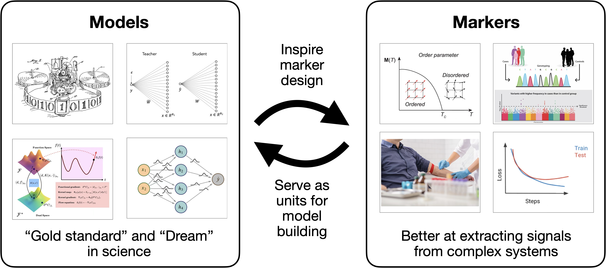
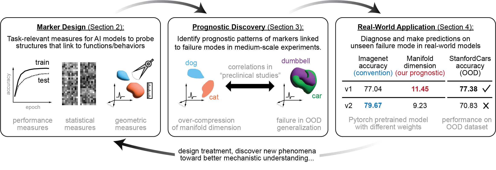
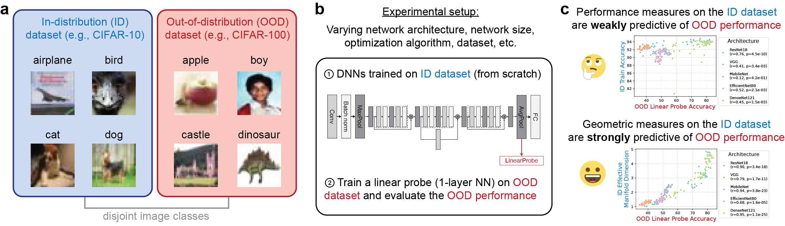

# Diagnosing Generalization Failures from Representational Geometry Markers
Repo for reproducing our ICLR 2026 paper "Diagnosing Generalization Failures from Representational Geometry Markers", Chi-Ning Chou, Artem Kirsanov, Yao-Yuan Yang, SueYeon Chung.
[OpenReview](https://openreview.net/forum?id=c2fQBcoKhU) · [arXiv:2603.01879](https://arxiv.org/abs/2603.01879)

## Overview

Deep neural networks fail on out-of-distribution (OOD) data in ways that are difficult to anticipate. A dominant research thread addresses this through mechanistic interpretability: reverse-engineering internal computations by identifying features, circuits, or causal structures. These bottom-up approaches yield rich microscopic understanding, but they struggle to provide the macroscopic, system-level view needed to *predict* and *prevent* failures before they occur.

We draw an analogy to a recurring pattern in science: the interplay between **model-first** and **marker-first** paradigms. Model-first approaches construct mechanistic frameworks to generate causal predictions. Marker-first approaches instead prioritize empirically observable summaries — order parameters in physics, biomarkers in medicine, training curves in ML — that reliably track system behavior without requiring a complete mechanistic account. The two paradigms form a productive feedback loop: markers surface phenomena worth explaining; models consolidate those findings into theory. Neural networks, as high-dimensional emergent systems, are natural candidates for a diagnostic, marker-first science that can anticipate failure modes and later guide mechanistic insight.

<p align="center"></p>

This paper proposes a **top-down, diagnostic framework** for understanding DNN generalization. Rather than reconstructing internal mechanisms, we design task-relevant *markers* — measurements extracted from the representation space that serve as reliable indicators of failure. We consider three families: performance-based measures (accuracy, AUROC, entropy), statistical measures (covariance structure, neural collapse), and geometric measures of representational manifold structure (effective dimension, radius, utility).

<p align="center"></p>

The central empirical finding is that standard performance measures computed on in-distribution data are **weakly predictive** of OOD generalization, whereas geometric measures of representational structure are **strongly predictive** — even across architectures, optimizers, and dataset scales. This holds in controlled experiments (Section 3) and transfers to real-world pretrained models, where geometry markers correctly rank weight variants (e.g., ResNet-50 V1 vs V2) by their OOD accuracy across nine downstream datasets (Section 4).

<p align="center"></p>


## Citation

```bibtex
@inproceedings{
chou2026diagnosing,
title={Diagnosing Generalization Failures from Representational Geometry Markers},
author={Chi-Ning Chou and Artem Kirsanov and Yao-Yuan Yang and SueYeon Chung},
booktitle={The Fourteenth International Conference on Learning Representations},
year={2026},
url={https://openreview.net/forum?id=c2fQBcoKhU}
}
```


## Installation

The analysis of this work was primarily built on top of [GLUE](https://docs.google.com/forms/d/e/1FAIpQLSc_IHUkc2zlJv0DIhSL_tiyD7Ty4nCeFdW0U7s-hCVWchefBg/viewform) and [here's a link](https://docs.google.com/forms/d/e/1FAIpQLSc_IHUkc2zlJv0DIhSL_tiyD7Ty4nCeFdW0U7s-hCVWchefBg/viewform) to request for early access to their codebase.


### 1. Clone and create the environment

```bash
git clone https://github.com/chung-neuroai-lab/ood-generalization-geometry.git
cd ood-generalization-geometry
conda env create -f environment.yml
conda activate ood-geometry
```

> **PyTorch**: The `environment.yml` targets CUDA 12.1. For a different CUDA version or CPU-only use, follow the [PyTorch install guide](https://pytorch.org/get-started/locally/) and adjust the `pytorch-cuda` line accordingly.

> **GLUE**: This repo requires the [GLUE](https://docs.google.com/forms/d/e/1FAIpQLSc_IHUkc2zlJv0DIhSL_tiyD7Ty4nCeFdW0U7s-hCVWchefBg/viewform) package (under review, to be released). Request early access via [this link](https://docs.google.com/forms/d/e/1FAIpQLSc_IHUkc2zlJv0DIhSL_tiyD7Ty4nCeFdW0U7s-hCVWchefBg/viewform), then install it into the environment before running the notebooks.


## Quickstart

### Reproduce paper figures (no GPU required, ~1 min)

```bash
jupyter notebook figures.ipynb
```

All pre-computed results are in `data/`. Runs Figs 3–4 and 6–20.

### Run the end-to-end marker demo (~2 min on CPU)

```bash
jupyter notebook example.ipynb
```

Loads the provided ResNet-18 checkpoint, extracts CIFAR-10 test-set features, and computes all three families of markers. Edit `CIFAR10_ROOT` in the notebook to point to your CIFAR-10 data directory (auto-downloaded if absent).

### Pretrained model geometry demo (~2 min on CPU)

```bash
jupyter notebook pretrained_demo.ipynb
```

Compares ResNet-50 V1 vs V2 geometry on a small ImageNet subset, illustrating the Section 4 analysis. Requires a local ImageNet validation set; set `IMAGENET_VAL_ROOT` in the notebook.

## Training your own models (Section 3 sweep)

`scripts/train.py` trains a single CIFAR-10 model. Wrap it in a shell loop for the full sweep.

```bash
python scripts/train.py \
    --arch ResNet18 \
    --optimizer SGD \
    --lr 0.1 \
    --weight_decay 5e-4 \
    --seed 0 \
    --epochs 200 \
    --data_dir /path/to/cifar10 \
    --checkpoint_dir ./checkpoints/ResNet18
```

Supported `--arch`: `ResNet18`, `ResNet34`, `ResNet50`, `VGG13`, `VGG19`, `DenseNet121`, `MobileNet`, `EfficientNetB0`.
Supported `--optimizer`: `SGD`, `AdamW`.


## Reusing the `analysis` package

```python
import sys
sys.path.insert(0, '/path/to/ood-generalization-geometry')

from analysis import logit_analysis, stat_analysis, geo_analysis

# logits: (N, C) array, correct: (N,) bool, target: (N,) int
results_logit = logit_analysis(logits, correct, target)

# X: (N, d) feature matrix, class-ordered (M samples per class contiguously)
results_stat = stat_analysis(X)
results_geo  = geo_analysis(X, num_classes=C, M=M)
```

Each function returns a dict of scalar markers. See `example.ipynb` for a full walkthrough and the docstrings in `analysis/` for parameter details.

## Data

- **CIFAR-10**: auto-downloaded by `torchvision` the first time you run `example.ipynb`.
- **Pre-computed results** (`data/df_fig*.pkl`): included in the repo (~400 KB total); used directly by `figures.ipynb`.
- **ImageNet**: required for `pretrained_demo.ipynb`. Not redistributed; obtain from [image-net.org](https://image-net.org).
- **Full Section 4 reproduction** (Fig 5, all 20 architectures × 9 OOD datasets): requires ImageNet and 9 downstream transfer datasets. Not included; see the paper appendix for the experimental protocol.


## License

MIT
